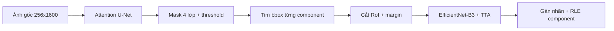

# Graduation Project — Phát hiện khuyết tật thép (Severstal)

Hệ thống **hai giai đoạn** phát hiện khuyết tật bề mặt thép:

1. **Phân đoạn (Stage 1):** Attention U-Net + encoder EfficientNet-B3 → mask 4 lớp khuyết tật.
2. **Phân loại (Stage 2):** Cắt RoI từ mask dự đoán → EfficientNet-B3 multi-label (+ TTA ngang).

Repository đóng gói **pipeline suy luận và đánh giá end-to-end**: nhận ảnh đầu vào, trả về **mã RLE** vị trí lỗi và **tên loại khuyết tật**.

## Mục lục

- [Yêu cầu hệ thống](#yêu-cầu-hệ-thống)
- [Cấu trúc thư mục](#cấu-trúc-thư-mục)
- [Cài đặt](#cài-đặt)
- [Tải dataset](#tải-dataset)
- [Chuẩn bị weights](#chuẩn-bị-weights)
- [Quy trình chạy nhanh](#quy-trình-chạy-nhanh)
- [Kiểm tra môi trường (`verify_setup.py`)](#kiểm-tra-môi-trường-verify_setuppy)
- [Suy luận (inference)](#suy-luận-inference)
- [Đánh giá end-to-end (`run_e2e_eval.py`)](#đánh-giá-end-to-end-run_e2e_evalpy)
- [Sử dụng trong Python](#sử-dụng-trong-python)
- [Định dạng kết quả](#định-dạng-kết-quả)
- [Luồng suy luận](#luồng-suy-luận)
- [Cấu hình (`inference_config.py`)](#cấu-hình-inference_configpy)
- [Gói nộp đồ án](#gói-nộp-đồ-án)
- [Xử lý lỗi thường gặp](#xử-lý-lỗi-thường-gặp)
- [License](#license)

---

## Yêu cầu hệ thống

| Thành phần | Yêu cầu |
|------------|---------|
| Python | **3.10+** (đã test 3.10–3.13) |
| RAM | ≥ 8 GB (khuyến nghị) |
| GPU | Tùy chọn: NVIDIA (CUDA), Apple Silicon (MPS), hoặc CPU |
| Ổ cứng | ~2 GB cho weights; dataset Severstal ~1.5 GB |

---

## Cấu trúc thư mục

```
├── config.py                 # Hyperparameter huấn luyện (tham chiếu)
├── inference_config.py       # Cấu hình suy luận: size ảnh, weights, ngưỡng
├── main.py                   # Entry point nhanh: python main.py <ảnh>
├── predict.py                # CLI suy luận (batch, JSON, visualization)
├── run_inference.py          # CLI suy luận đầy đủ (submission Kaggle, vis)
├── run_e2e_eval.py           # Đánh giá end-to-end trên tập validation
├── verify_setup.py           # Kiểm tra môi trường trước khi chạy
├── requirements.txt
├── weights/                  # Checkpoint (không commit — xem bên dưới)
│   ├── best_Attunet_efficientnet_b3.pth
│   ├── classifier_best.pth
│   ├── thresholds_seg.npy    # (tùy chọn)
│   └── thresholds_cls.npy    # (tùy chọn)
├── Dataset/                  # Dữ liệu Severstal (không commit — xem bên dưới)
│   ├── train.csv
│   ├── train_images/
│   └── test_images/
├── outputs/                  # Kết quả JSON, CSV, log, hình visualization
│   ├── vis/                  # Ảnh minh họa inference
│   ├── e2e_per_class.csv     # Bảng metrics theo lớp (sau E2E eval)
│   └── e2e_system_summary.csv# Bảng tổng hệ thống (Bảng 5.14)
└── src/
    ├── data/                 # Dataset, mask, RLE
    ├── inference/            # Pipeline, RoI, submission, visualization
    ├── metrics/              # Dice, đánh giá E2E
    ├── models/               # Kiến trúc U-Net, classifier
    └── losses/               # Loss functions (tham chiếu huấn luyện)
```

### Script chính — khi nào dùng?

| Script | Mục đích |
|--------|----------|
| `verify_setup.py` | Kiểm tra Python, packages, weights, dataset trước khi chạy |
| `main.py` | Suy luận **một ảnh**, in kết quả ra terminal (nhanh nhất) |
| `run_inference.py` | Suy luận đầy đủ: batch, JSON, visualization, submission Kaggle |
| `predict.py` | CLI suy luận thay thế; chỉ định weights tùy ý |
| `run_e2e_eval.py` | Đánh giá pipeline trên tập validation; xuất CSV báo cáo |

---

## Cài đặt

```bash
cd "Graduation Project"
python -m venv .venv
source .venv/bin/activate          # Windows: .venv\Scripts\activate
pip install -r requirements.txt
```

**Dependencies chính** (`requirements.txt`):

| Package | Dùng cho |
|---------|----------|
| `torch`, `torchvision` | Mô hình & suy luận |
| `opencv-python` | Đọc ảnh, xử lý mask |
| `albumentations` | Tiền xử lý ảnh |
| `numpy`, `pandas` | Dữ liệu, CSV |
| `matplotlib` | Visualization |
| `scikit-learn` | Chia train/val trong E2E eval |
| `tqdm` | Tiến trình E2E eval |

Sau cài đặt, chạy kiểm tra:

```bash
python verify_setup.py
```

---

## Tải dataset

Dataset: [Severstal Steel Defect Detection](https://www.kaggle.com/competitions/severstal-steel-defect-detection) (Kaggle).

### Cách 1 — Kaggle CLI (khuyến nghị)

```bash
pip install kaggle
# Đặt kaggle.json vào ~/.kaggle/ (Kaggle → Account → Create New Token)
kaggle competitions download -c severstal-steel-defect-detection
unzip severstal-steel-defect-detection.zip -d Dataset
```

### Cách 2 — Tải thủ công

Tải từ trang competition, giải nén sao cho có cấu trúc:

```
Dataset/
├── train.csv
├── train_images/*.jpg
└── test_images/*.jpg
```

`train.csv` chứa cột `ImageId`, `ClassId`, `EncodedPixels` (RLE) — dùng cho đánh giá E2E.

---

## Chuẩn bị weights

Checkpoint **không nằm trong Git** (file lớn). Khi nộp đồ án, đính kèm thư mục `weights/` cùng mã nguồn (ZIP / Google Drive).

| File trong `weights/` | Mô tả |
|----------------------|--------|
| `best_Attunet_efficientnet_b3.pth` | Stage 1 — segmentation (**bắt buộc**) |
| `classifier_best.pth` | Stage 2 — classifier RoI (**bắt buộc**) |
| `thresholds_seg.npy` | Ngưỡng Dice per-class Stage 1 (tùy chọn, 4 số) |
| `thresholds_cls.npy` | Ngưỡng F1 per-class Stage 2 (tùy chọn, 4 số) |

Nếu thiếu file `.npy`, pipeline dùng ngưỡng mặc định **0.5** cho cả 4 lớp.

---

## Quy trình chạy nhanh

Thứ tự khuyến nghị từ lần đầu setup đến nộp báo cáo:

```bash
# 1. Kiểm tra môi trường
python verify_setup.py

# 2. Suy luận thử một ảnh + lưu minh họa
python run_inference.py \
  --image Dataset/train_images/0002cc93b.jpg \
  --save-vis outputs/vis/demo.png

# 3. Đánh giá nhanh (20 ảnh validation) — smoke test
python run_e2e_eval.py --limit 20 --device cpu

# 4. Đánh giá đầy đủ trên toàn tập validation (~6 phút trên MPS)
python run_e2e_eval.py --device mps

# 5. (Tùy chọn) Xuất submission Kaggle trên test set
python run_inference.py \
  --image-dir Dataset/test_images \
  --submission outputs/submission.csv
```

---

## Kiểm tra môi trường (`verify_setup.py`)

Script kiểm tra **không chạy mô hình** — chỉ xác nhận đủ điều kiện chạy inference/eval.

```bash
python verify_setup.py
```

**Kiểm tra gì:**

- Phiên bản Python ≥ 3.10
- Các package trong `requirements.txt`
- File bắt buộc trong `weights/`
- File tùy chọn `thresholds_*.npy`
- `Dataset/train.csv`, `train_images/`, `test_images/`
- Device mặc định (CUDA → MPS → CPU)

**Kết quả:**

- `✓ Sẵn sàng chạy` — có thể chạy inference/eval
- `✗ Còn thiếu...` — làm theo hướng dẫn trong output và các mục **Cài đặt / weights / dataset** ở trên

---

## Suy luận (inference)

### `main.py` — một ảnh, in terminal

```bash
python main.py Dataset/train_images/0002cc93b.jpg
```

In ra: tên khuyết tật, `class_id`, `confidence`, `bbox`, preview chuỗi RLE.

### `run_inference.py` — đầy đủ tính năng

**Một ảnh — hiển thị cửa sổ matplotlib (4 cột: input | segmentation | output | classification):**

```bash
python run_inference.py --image Dataset/train_images/0002cc93b.jpg --show
```

**Một ảnh — lưu figure (phù hợp minh chứng nộp đồ án):**

```bash
python run_inference.py \
  --image Dataset/train_images/0002cc93b.jpg \
  --save-vis outputs/vis/demo.png
```

**Nhiều ảnh — lưu JSON:**

```bash
python run_inference.py \
  --image-dir Dataset/train_images \
  --limit 5 \
  --output outputs/predictions.json
```

**Nhiều ảnh — lưu visualization tự động vào `outputs/vis/<tên_ảnh>_inference.png`:**

```bash
python run_inference.py \
  --image-dir Dataset/train_images \
  --limit 10 \
  --show
```

**Submission format Kaggle** (cần `--image-dir`):

```bash
python run_inference.py \
  --image-dir Dataset/test_images \
  --submission outputs/submission.csv
```

**Thiết bị** — mặc định tự chọn CUDA → MPS → CPU:

```bash
python run_inference.py --image path.jpg --device cpu
python run_inference.py --image path.jpg --device cuda   # NVIDIA GPU
python run_inference.py --image path.jpg --device mps    # Apple Silicon
```

#### Tham số `run_inference.py`

| Tham số | Mô tả |
|---------|--------|
| `--image` | Đường dẫn **một** ảnh |
| `--image-dir` | Thư mục chứa `*.jpg` (batch) |
| `--limit` | Giới hạn số ảnh (0 = tất cả) |
| `--output` | Lưu kết quả JSON (dict: tên file → list detection) |
| `--submission` | Lưu CSV submission Kaggle (cần `--image-dir`) |
| `--device` | `cpu`, `cuda`, hoặc `mps` |
| `--show` | Hiện figure matplotlib |
| `--save-vis` | Đường dẫn PNG (1 ảnh); batch → `outputs/vis/` |
| `--vis-dir` | Thư mục lưu ảnh khi batch (mặc định `outputs/vis`) |

### `predict.py` — CLI thay thế

Hỗ trợ chỉ định checkpoint và chế độ `--quiet`:

```bash
# Một ảnh
python predict.py --image Dataset/train_images/0002cc93b.jpg

# Batch + JSON
python predict.py \
  --image-dir Dataset/train_images \
  --limit 5 \
  --output outputs/predictions.json

# Chỉ định weights
python predict.py \
  --image path.jpg \
  --seg-weights weights/best_Attunet_efficientnet_b3.pth \
  --cls-weights weights/classifier_best.pth

# Visualization
python predict.py --image path.jpg --show
python predict.py --image path.jpg --save-vis outputs/vis/result.png
```

#### Tham số `predict.py`

| Tham số | Mô tả |
|---------|--------|
| `--image` | Một ảnh |
| `--image-dir` | Thư mục ảnh (`*.jpg`, `*.png`) |
| `--limit` | Giới hạn số ảnh |
| `--seg-weights` | Checkpoint Stage 1 |
| `--cls-weights` | Checkpoint Stage 2 |
| `--device` | `cpu` hoặc `cuda` |
| `--output` | File JSON kết quả |
| `--quiet` | Không in chi tiết ra terminal |
| `--show` / `--save-vis` | Visualization |

Ngưỡng đã tune được load tự động từ `weights/thresholds_seg.npy` và `weights/thresholds_cls.npy` (nếu có).

---

## Đánh giá end-to-end (`run_e2e_eval.py`)

Script chạy **toàn bộ pipeline** trên tập validation (20% `train.csv`, `random_state=42`, `train_test_split` từ scikit-learn), so khớp prediction với ground truth và xuất bảng báo cáo.

### Chạy cơ bản

```bash
# Toàn bộ tập validation (mặc định ~1334 ảnh)
python run_e2e_eval.py

# Smoke test — 20 ảnh, CPU
python run_e2e_eval.py --limit 20 --device cpu

# Chỉ định thư mục output
python run_e2e_eval.py --output-dir outputs
```

### Tham số đầy đủ

| Tham số | Mặc định | Mô tả |
|---------|----------|--------|
| `--csv` | `Dataset/train.csv` | File CSV nhãn |
| `--image-dir` | `Dataset/train_images` | Thư mục ảnh train |
| `--val-split` | `0.2` | Tỷ lệ validation (20%) |
| `--seed` | `42` | Seed chia train/val |
| `--limit` | `0` | Giới hạn số ảnh val (0 = tất cả) |
| `--iou-threshold` | `0.5` | Ngưỡng IoU để ghép cặp instance |
| `--device` | auto | `cpu`, `cuda`, `mps` |
| `--output-dir` | `outputs` | Nơi lưu CSV |
| `--gt-mode` | `rle` | `rle` hoặc `component` (định nghĩa GT instance) |
| `--match-mode` | `end_to_end` | `end_to_end` hoặc `legacy` |
| `--min-component-area` | `20` | Chỉ khi `--gt-mode component` |

**Ví dụ nâng cao:**

```bash
# Tái hiện logic báo cáo cũ (component GT + match legacy)
python run_e2e_eval.py \
  --gt-mode component \
  --match-mode legacy \
  --limit 100

# IoU 0.75, validation 10%
python run_e2e_eval.py --val-split 0.1 --iou-threshold 0.75
```

### File kết quả

Sau khi chạy, in ra terminal **2 bảng** và lưu:

| File | Nội dung |
|------|----------|
| `outputs/e2e_per_class.csv` | GT instances, Predicted instances, Spatial matches, Precision, Recall, Dice **theo lớp** + dòng Tổng |
| `outputs/e2e_system_summary.csv` | Chỉ số tổng hệ thống (**Bảng 5.14** trong báo cáo) |

### Giải thích chỉ số

**Bảng theo lớp (`e2e_per_class.csv`):**

| Cột | Ý nghĩa |
|-----|---------|
| GT instances | Số instance ground truth của lớp |
| Predicted instances | Số vùng model dự đoán (theo lớp classifier) |
| Spatial matches | Số cặp ghép IoU ≥ ngưỡng **và cùng lớp** (end-to-end) |
| Precision | Spatial matches / Predicted instances |
| Recall | Spatial matches / GT instances |
| Dice | Dice coefficient trên các cặp match đúng lớp |

**Bảng tổng hệ thống (`e2e_system_summary.csv`):**

| Chỉ số | Ý nghĩa |
|--------|---------|
| Tổng số ảnh kiểm thử | Số ảnh validation được eval |
| Số ảnh dự đoán đúng ít nhất một khuyết tật | Ảnh có ≥1 match end-to-end |
| Tỷ lệ Recall ở cấp độ ảnh (%) | Tỷ lệ ảnh có ít nhất một detection đúng |
| GT / Predicted Instances | Tổng instance GT và prediction |
| Spatial Matches | Ghép cặp IoU + cùng lớp |
| End-to-end | Bằng Spatial matches (chế độ mặc định) |
| Độ chính xác phân loại trên RoI trùng khớp (%) | Trên các cặp đã ghép, lớp classifier có khớp GT |
| Miss Rate / False Alarm Rate | Tỷ lệ bỏ sót / báo động giả ở cấp instance |
| Instance Recall / Precision (%) | Macro trên toàn tập |
| Dice trung bình | Dice trên cặp match đúng lớp |

**Định nghĩa GT instance (mặc định `--gt-mode rle`):** mỗi dòng RLE hợp lệ trong `train.csv` = một instance.

**Ghép cặp (mặc định `--match-mode end_to_end`):** IoU ≥ `--iou-threshold` **và** cùng `ClassId`.

### Thời gian chạy tham khảo

| Cấu hình | Thời gian gần đúng |
|----------|-------------------|
| `--limit 20 --device cpu` | ~1–2 phút |
| Toàn validation (~1334 ảnh), MPS | ~6 phút |
| Toàn validation, CPU | ~30–60 phút |

---

## Sử dụng trong Python

```python
from src.inference.pipeline import predict, DefectInferencePipeline

# Cách 1 — hàm tiện ích (trả list dict)
results = predict("Dataset/train_images/0a4ad45a5.jpg")
for det in results:
    print(det["defect_name"], det["confidence"], det["rle"][:80])

# Cách 2 — pipeline đầy đủ
pipe = DefectInferencePipeline(
    seg_checkpoint="weights/best_Attunet_efficientnet_b3.pth",
    cls_checkpoint="weights/classifier_best.pth",
    device="cuda",  # hoặc "mps", "cpu"
)
detections = pipe.predict("path/to/image.jpg")
for d in detections:
    print(d.defect_name, d.class_id, d.confidence)

# Cách 3 — kết quả chi tiết cho visualization
result = pipe.predict_detailed("path/to/image.jpg")
# result.image_resized, result.mask_seg, result.detections, result.roi_items

from src.inference.visualize import plot_inference_result
plot_inference_result(result, save_path="outputs/vis/from_api.png", show=False)
```

**Submission từ Python:**

```python
from src.inference.submission import predict_folder_to_submission

predict_folder_to_submission(
    "Dataset/test_images",
    "outputs/submission.csv",
    pipeline=pipe,
)
```

---

## Định dạng kết quả

Mỗi detection là `dict` (hoặc dataclass `DefectDetection`):

| Trường | Mô tả |
|--------|--------|
| `class_id` | 1–4 (Severstal) |
| `defect_name` | Tên tiếng Việt + tiếng Anh |
| `rle` | Chuỗi RLE mask trên ảnh 256×1600 |
| `bbox` | `(x1, y1, x2, y2)` vùng RoI đã cắt |
| `confidence` | Xác suất classifier cho lớp được chọn |
| `probabilities` | Dict xác suất 4 lớp từ EfficientNet-B3 |
| `seg_class_id` | Lớp segmentation gốc của component (nếu có) |

### Bốn loại khuyết tật

| ClassId | Tên |
|--------|-----|
| 1 | Vết xước (Scratches) |
| 2 | Tạp chất (Inclusions) |
| 3 | Bề mặt lõm (Pitted surface) |
| 4 | Vết bẩn (Stains) |

### JSON output (`--output`)

```json
{
  "0002cc93b.jpg": [
    {
      "class_id": 1,
      "defect_name": "Vết xước (Scratches)",
      "rle": "1 3 5 7 ...",
      "bbox": [10, 20, 100, 80],
      "confidence": 0.886,
      "probabilities": {"1": 0.89, "2": 0.01, "3": 0.05, "4": 0.02}
    }
  ]
}
```

---

## Luồng suy luận



1. Resize & normalize ảnh theo `inference_config.py`.
2. Sigmoid + ngưỡng per-class → mask nhị phân `[4, H, W]`.
3. Với mỗi connected component: mở rộng bbox, cắt crop, classify (TTA lật ngang nếu bật).
4. Giao mask segmentation và nhãn classifier → mã hóa **RLE** cho từng detection.

---

## Cấu hình (`inference_config.py`)

Chỉnh trong `INFERENCE_CFG` khi cần:

| Khóa | Mặc định | Mô tả |
|------|----------|--------|
| `image_height`, `image_width` | 256, 1600 | Kích thước ảnh inference |
| `seg_thresholds` | 0.5 × 4 | Ngưỡng mask (hoặc dùng `thresholds_seg.npy`) |
| `cls_thresholds` | 0.5 × 4 | Ngưỡng classifier (hoặc `thresholds_cls.npy`) |
| `cls_crop_size` | (448, 448) | Kích thước crop RoI |
| `cls_use_tta` | `True` | Test-time augmentation ngang |
| `bbox_margin` | 12 | Pixel mở rộng bbox |
| `min_component_area` | 20 | Diện tích tối thiểu component seg |
| `max_detections_per_image` | 16 | Giới hạn detection/ảnh |
| `label_min_pixels` | 8 | Pixel tối thiểu trong RoI để gán lớp seg |

---

## Gói nộp đồ án

### Checklist

- [ ] Toàn bộ mã nguồn (thư mục project)
- [ ] `weights/` — 2 file `.pth` bắt buộc + 2 file `.npy` ngưỡng (nếu có)
- [ ] `Readme.md` (file này)
- [ ] `requirements.txt`
- [ ] `outputs/vis/demo.png` — minh họa suy luận (chạy lệnh ở [Quy trình chạy nhanh](#quy-trình-chạy-nhanh))
- [ ] `outputs/e2e_per_class.csv` và `outputs/e2e_system_summary.csv` — kết quả đánh giá

**Không cần** nộp toàn bộ `Dataset/` (~GB) trừ khi giảng viên yêu cầu; ghi link Kaggle trong báo cáo.

### Lệnh tạo minh chứng trước khi nộp

```bash
python verify_setup.py
python run_inference.py --image Dataset/train_images/0002cc93b.jpg --save-vis outputs/vis/demo.png
python run_e2e_eval.py --output-dir outputs
```

---

## Xử lý lỗi thường gặp

| Lỗi | Cách xử lý |
|-----|------------|
| `Không tìm thấy segmentation checkpoint` | Đặt `best_Attunet_efficientnet_b3.pth` vào `weights/` |
| `Không tìm thấy classifier checkpoint` | Đặt `classifier_best.pth` vào `weights/` |
| `ModuleNotFoundError: sklearn` | `pip install -r requirements.txt` |
| `ModuleNotFoundError: cv2` | `pip install opencv-python` |
| `Không tìm thấy CSV / thư mục ảnh` | Tải dataset theo mục [Tải dataset](#tải-dataset) |
| `parser.error: Cần --image hoặc --image-dir` | Thêm `--image` hoặc `--image-dir` |
| Submission không tạo file | Cần **cả** `--image-dir` và `--submission` |
| Chạy chậm trên CPU | Dùng `--limit` nhỏ khi eval; inference 1 ảnh vẫn OK (~15s) |
| Cảnh báo `AVFFrameReceiver` (Mac) | Cảnh báo từ OpenCV/av — thường không ảnh hưởng kết quả |
| Cảnh báo `pretrained` deprecated | Từ torchvision — không ảnh hưởng inference |
| MPS/CUDA không khả dụng | Pipeline tự fallback CPU; hoặc `--device cpu` |

---

## Ghi chú kỹ thuật

- Ảnh đầu vào: grayscale Severstal; pipeline tự chuyển sang 3 kênh RGB.
- Kích thước mặc định: **256 × 1600** (H × W).
- RLE theo format Kaggle Severstal (1-based, column-major).
- `src/losses/`, `config.py`: tham chiếu huấn luyện; **không cần** để chạy inference/eval.

---

## License

Dự án tốt nghiệp cá nhân — dataset [Severstal Steel Defect Detection](https://www.kaggle.com/competitions/severstal-steel-defect-detection).
