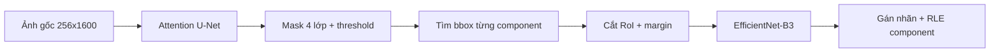

# Graduation Project — Phát hiện khuyết tật thép (Severstal)

Hệ thống **hai giai đoạn** huấn luyện trong notebook [`graduation-project-phase-2.ipynb`](https://github.com/) (Attention U-Net + EfficientNet-B3):

1. **Phân đoạn (Stage 1):** Attention U-Net với encoder EfficientNet-B3 → mask 4 lớp khuyết tật.
2. **Phân loại (Stage 2):** Cắt RoI từ mask dự đoán → EfficientNet-B3 multi-label + Focal Loss.

Repository này **đóng gói pipeline suy luận** để chạy ngoài Kaggle: một hàm `predict(image)` trả về **mã RLE** vị trí lỗi và **tên loại khuyết tật**.

## Cấu trúc thư mục

```
├── inference_config.py      # Cấu hình kích thước ảnh, đường dẫn weights, ngưỡng
├── predict.py               # Script CLI
├── weights/                 # Đặt checkpoint sau khi train (không commit file lớn)
│   ├── best_Attunet_efficientnet_b3.pth
│   ├── classifier_best.pth
│   ├── thresholds_seg.npy   # (tùy chọn) ngưỡng Dice đã tune Stage 1
│   └── thresholds_cls.npy   # (tùy chọn) ngưỡng F1 đã tune Stage 2
├── src/
│   ├── models/
│   │   ├── attention_unet_efficientnet_b3.py
│   │   └── efficientnet_multilabel.py
│   └── inference/
│       ├── pipeline.py      # DefectInferencePipeline + predict()
│       ├── roi.py           # Trích bbox / component mask
│       ├── rle_utils.py     # Mã hóa RLE (Kaggle)
│       └── transforms.py    # Tiền xử lý Albumentations
└── Jupyter Notebook/        # Notebook thử nghiệm / train
```

## Cài đặt

```bash
cd "/Users/thachphung/Documents/Graduation Project"
python -m venv .venv
source .venv/bin/activate
pip install -r requirements.txt
```

## Chuẩn bị weights

Sau khi train trên Kaggle hoặc local, sao chép file vào `weights/`:

| File nguồn (notebook) | Đích |
|----------------------|------|
| `best_Attunet_efficientnet_b3.pth` | `weights/best_Attunet_efficientnet_b3.pth` |
| `cls_stage2_pred/classifier_best.pth` | `weights/classifier_best.pth` |
| `thresholds_unet_effb3.npy` | `weights/thresholds_seg.npy` |
| `cls_stage2_pred/cls_thresholds_best.npy` | `weights/thresholds_cls.npy` |

Nếu thiếu file `.npy`, pipeline dùng ngưỡng mặc định `0.5` cho cả 4 lớp.

## Sử dụng trong Python

```python
from src.inference.pipeline import predict, DefectInferencePipeline

# Cách 1 — hàm tiện ích
results = predict("Dataset/train_images/0a4ad45a5.jpg")
for det in results:
    print(det["defect_name"], det["rle"][:80], "...")

# Cách 2 — kiểm soát đầy đủ
pipe = DefectInferencePipeline(
    seg_checkpoint="weights/best_Attunet_efficientnet_b3.pth",
    cls_checkpoint="weights/classifier_best.pth",
    device="cuda",
)
detections = pipe.predict("path/to/image.jpg")
for d in detections:
    print(d.defect_name, d.class_id, d.confidence)
```

### Định dạng kết quả

Mỗi phần tử là `dict` (hoặc `DefectDetection`):

| Trường | Mô tả |
|--------|--------|
| `class_id` | 1–4 (Severstal) |
| `defect_name` | Tên tiếng Việt + tiếng Anh |
| `rle` | Chuỗi RLE mask trên ảnh 256×1600 |
| `bbox` | `(x1, y1, x2, y2)` vùng RoI đã cắt |
| `confidence` | Xác suất classifier cho lớp được chọn |
| `probabilities` | Xác suất 4 lớp từ EfficientNet-B3 |

### Bốn loại khuyết tật

| ClassId | Tên |
|--------|-----|
| 1 | Vết xước (Scratches) |
| 2 | Tạp chất (Inclusions) |
| 3 | Bề mặt lõm (Pitted surface) |
| 4 | Vết bẩn (Stains) |

## Chạy suy luận (đã có weights)

```bash
# Một ảnh + hiển thị (input | segmentation | output | classification)
python run_inference.py --image Dataset/train_images/0002cc93b.jpg --show

# Lưu figure ra file
python run_inference.py --image Dataset/train_images/0002cc93b.jpg --save-vis outputs/vis/result.png

# Nhiều ảnh + lưu JSON
python run_inference.py --image-dir Dataset/train_images --limit 5 --output outputs/predictions.json

# Submission Kaggle
python run_inference.py --image-dir Dataset/test_images --submission outputs/submission.csv

# Hoặc
python predict.py --image Dataset/train_images/0002cc93b.jpg
```

Ngưỡng đã tune được load tự động từ `weights/thresholds_seg.npy` và `weights/thresholds_cls.npy`.

## Luồng suy luận (tóm tắt)



1. Resize & normalize ảnh theo cấu hình segmentation.
2. Sigmoid + ngưỡng per-class → mask nhị phân `[4, H, W]`.
3. Với mỗi connected component: mở rộng bbox, cắt crop, classify (TTA ngang tùy chọn).
4. Kết hợp mask segmentation và nhãn classifier → mã hóa **RLE** cho từng detection.

## Ghi chú đồ án

- Notebook gốc: `graduation-project-phase-2.ipynb` (Desktop hoặc Kaggle).
- Ảnh đầu vào: grayscale Severstal; pipeline tự chuyển sang 3 kênh RGB.
- Kích thước mặc định: **256 × 1600** (có thể chỉnh trong `inference_config.py` nếu train khác size).

## License

Dự án tốt nghiệp cá nhân — dataset [Severstal Steel Defect Detection](https://www.kaggle.com/competitions/severstal-steel-defect-detection).
